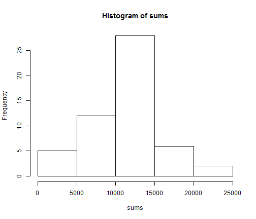
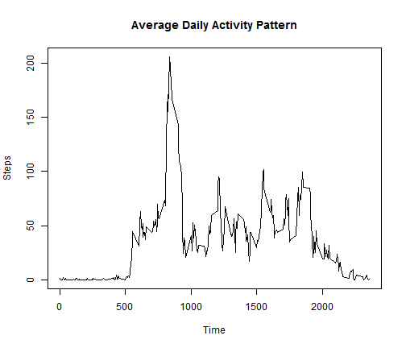
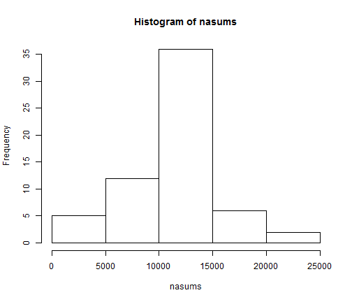
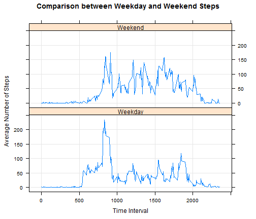

# Reproducible Research: Peer Assessment 1

## Loading and preprocessing the data

```r
library(ggplot2)
library(lattice)
data <- read.csv("activity.csv")
dates <- as.Date(data$date, format = "%Y-%m-%d")
sums <- rowsum(data$steps, dates)
times <- array(seq(from = 0, to = 2355, by = 5), dim = c(472, 2))
for (i in 1:472) {
    times[i, 2] = sum(data$steps[data$interval == i * 5 - 5], na.rm = TRUE)/sum(!is.na(data$steps[data$interval == 
        i * 5 - 5]))
}
times <- subset(times, times[, 2] != "NaN")
```


## What is mean total number of steps taken per day?

Histogram of the total number of steps taken each day


```r
hist(sums)
```

 


Mean and Median total number of steps taken per day

```r
mean(sums, na.rm = TRUE)
```

```
## [1] 10766
```


```r
median(sums, na.rm = TRUE)
```

```
## [1] 10765
```


## What is the average daily activity pattern?

Make a time series plot (i.e. type = "l") of the 5-minute interval (x-axis) and the average number of steps taken, averaged across all days (y-axis)

```r
plot(times, type = "l", main = "Average Daily Activity Pattern", xlab = "Time", 
    ylab = "Steps")
```

 


Which 5-minute interval, on average across all the days in the dataset, contains the maximum number of steps?
max(times[,2])

```r
times[which.max(times[, 2]), 1]
```

```
## [1] 835
```


## Imputing missing values

Note that there are a number of days/intervals where there are missing values (coded as NA). The presence of missing days may introduce bias into some calculations or summaries of the data.

Calculate and report the total number of missing values in the dataset (i.e. the total number of rows with NAs)

```r
sum(is.na(data$steps))
```

```
## [1] 2304
```


Devise a strategy for filling in all of the missing values in the dataset. The strategy does not need to be sophisticated. For example, you could use the mean/median for that day, or the mean for that 5-minute interval, etc.

Create a new dataset that is equal to the original dataset but with the missing data filled in.

```r
nadata <- data
for (i in 1:nrow(nadata)) {
    if (is.na(nadata[i, 1]) == TRUE) 
        nadata[i, 1] <- times[match(nadata[i, 3], times[, 1]), 2]
}
```


Make a histogram of the total number of steps taken each day and Calculate and report the mean and median total number of steps taken per day. Do these values differ from the estimates from the first part of the assignment? What is the impact of imputing missing data on the estimates of the total daily number of steps?

```r
nasums <- rowsum(nadata$steps, dates)
hist(nasums)
```

 

```r
mean(nasums, na.rm = TRUE)
```

```
## [1] 10766
```

```r
median(nasums, na.rm = TRUE)
```

```
## [1] 10766
```


The values are basically the same. Since all I did was use the average in place of a missing value, it shouldn't affect the mean at all. It does make the median equal to the man however.

## Are there differences in activity patterns between weekdays and weekends?

Create a new factor variable in the dataset with two levels - "weekday" and "weekend" indicating whether a given date is a weekday or weekend day.


```r
weekdata <- data
weekdata$date <- as.character.factor(weekdata$date)


for (i in 1:nrow(weekdata)) {
    if (weekdays(as.Date(weekdata[i, 2])) == "Saturday" | weekdays(as.Date(weekdata[i, 
        2])) == "Sunday") {
        weekdata[i, 2] <- c("Weekend")
    } else {
        weekdata[i, 2] <- c("Weekday")
    }
}
```


Make a panel plot containing a time series plot (i.e. type = "l") of the 5-minute interval (x-axis) and the average number of steps taken, averaged across all weekday days or weekend days (y-axis). 


```r

wdtimes <- array(seq(from = 0, to = 2355, by = 5), dim = c(472, 3))
wetimes <- array(seq(from = 0, to = 2355, by = 5), dim = c(472, 3))
wenddata <- subset(weekdata, weekdata[, 2] == "Weekend")
wdaydata <- subset(weekdata, weekdata[, 2] == "Weekday")


for (i in 1:472) {
    wdtimes[i, 2] = sum(wdaydata$steps[weekdata$interval == i * 5 - 5], na.rm = TRUE)/sum(!is.na(wdaydata$steps[weekdata$interval == 
        i * 5 - 5]))
}
wdtimes <- subset(wdtimes, wdtimes[, 2] != "NaN")
for (i in 1:472) {
    wetimes[i, 2] = sum(wenddata$steps[weekdata$interval == i * 5 - 5], na.rm = TRUE)/sum(!is.na(wenddata$steps[weekdata$interval == 
        i * 5 - 5]))
}
wetimes <- subset(wetimes, wetimes[, 2] != "NaN")

wdtimes[, 3] <- 1
wetimes[, 3] <- 2

wdata <- rbind(wdtimes, wetimes)
colnames(wdata) <- c("Time", "Steps", "Day")
wdata[, 3][wdata[, 3] == 1] <- "Weekday"
wdata[, 3][wdata[, 3] == 2] <- "Weekend"

xyplot(as.numeric(wdata[, 2]) ~ as.numeric(wdata[, 1]) | wdata[, 3], grid = TRUE, 
    type = "l", main = "Comparison between Weekday and Weekend Steps", ylab = "Average Number of Steps", 
    layout = c(1, 2), xlab = "Time Interval")
```

 

